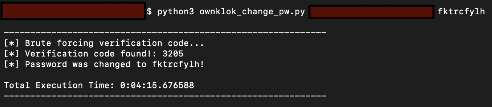

# CVE-2020-10876
>The OKLOK (3.1.1) mobile companion app for Fingerprint Bluetooth Padlock FB50 (2.3) does not correctly implement its timeout on the four-digit verification code that is required for resetting passwords, nor does it properly restrict excessive verification attempts. This allows an attacker to brute force the four-digit verification code in order to bypass email verification and change the password of a victim account.

## ownklok_change_pw.py
>PoC code to brute force the email verification code generated via the "Forgot Password" functionality in the OKLOK mobile app. The script resets the password of the victim account after brute forcing the verification code.

## verification_codes.txt
>This wordlist contains all of the possible verification codes for the app. Place in the same directory as the ownklok_change_pw.py script. 

## Usage
```python3 ownklok_change_pw.py <victim_email_address> <new_password>```

`<victim_email_address>` = the email address of the user account whose password will be changed</br>
`<new_password>` = the attacker's choice of the new password for the victim account

**DISCLAIMER** Use these scripts only against user accounts you own or have permission to test.

## Demo
Before running the script, generate a new verification code for the victim account to ensure reliability. A verification code can be created in the app by clicking "Forget your password?" from the login prompt and then entering the victim account email address and clicking "Send". The total brute force execution time will vary depending on a number of circumstances. Chunksize may need to be adjusted for your purposes.

**Note:** A verification code can also be requested via a script, but it requires prior knowlege of the "code" parameter that is sent in the body of the POST request that generates the code, which is specific to each account. The "code" parameter for your own account can be obtained by sending the verification code request in the app through a web proxy and viewing the body of the POST request.


