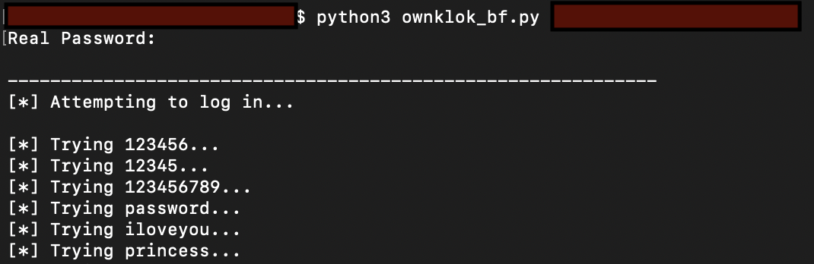
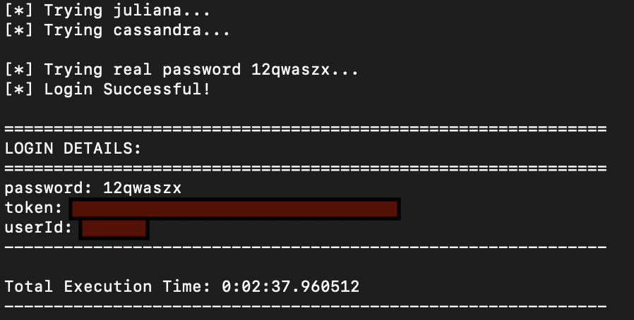
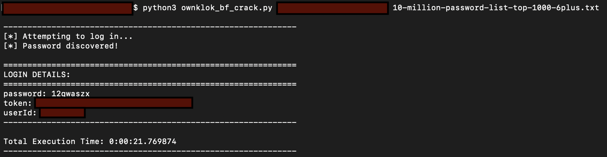

# CVE-2020-8790
>The OKLOK (3.1.1) mobile companion app for Fingerprint Bluetooth Padlock FB50 (2.3) has weak password requirements combined with improper restriction of excessive authentication attempts, which could allow a remote attacker to discover user credentials and obtain access via a brute force attack.

## ownklok_bf.py
>PoC to demonstrate "CWE-307: Improper Restrictions on Excessive Authentication Attempts" on the OKLOK (3.1.1) mobile app. With its default wordlist, the script runs through 1000 intentional incorrect passwords before successfully logging in with the known password on the 1001st try. The user inputs the real password before the login requests are sent, so this script is not designed to actually discover passwords. 

## ownklok_bf_crack.py
>PoC code to discover passwords via brute force logins against the OKLOK (3.1.1) mobile app. A wordlist must be supplied as an argument.

## rockyou_first1000.txt
>This list contains the first 1000 entries of the rockyou.txt wordlist from Kali Linux. Place in the same directory as the ownklok_bf.py script.

## 10-million-password-list-top-1000-6plus.txt
>This is [10-million-password-list-top-1000.txt](https://github.com/danielmiessler/SecLists/blob/master/Passwords/Common-Credentials/10-million-password-list-top-1000.txt) with the passwords under 6 characters removed.

**Note:** OKLOK passwords can range from 6 to 15 alphanumeric characters. Special characters are not allowed. 

## Usage
```python3 ownklok_bf.py <victim_email_address>``` <br/>
```python3 ownklok_bf_crack.py <victim_email_address> <wordlist_filename>```

`<victim_email_address>` = the email address of the user account you want to brute force <br/>
`<wordlist_filename>` = path to the wordlist you want to use for brute force

**DISCLAIMER** Use these scripts only against user accounts you own or have permission to test.

## Demos
Both demos illustrate a brute force simulation against a dummy victim account with a password from "10-million-password-list-top-1000.txt". Some details are redacted.

### ownklok_bf.py demo
The ownklok_bf.py demo shows 1000 consecutive login failures through the API, followed by a successful login. The outcome demonstrates "CWE-307: Improper Restrictions on Excessive Authentication Attempts" but does not actually discover the password via brute force. The real password is not in the wordlist that was fed to the script, which is the "rockyou_first1000.txt" wordlist provided in this repo. The total execution time will vary depending on a number of circumstances. 


**...**


### ownklok_bf_crack.py demo
The ownklok_bf_crack.py demo shows a brute force password crack, which guesses passwords from a wordlist until the password is found. This demo uses the "10-million-password-list-top-1000-6plus.txt" wordlist provided in this repo. The total execution time will vary depending on a number of circumstances. Chunksize may need to be adjusted for your purposes.

**Note:** It may take a little extra time for the multiprocessing pool to exit cleanly after the password is already found.


