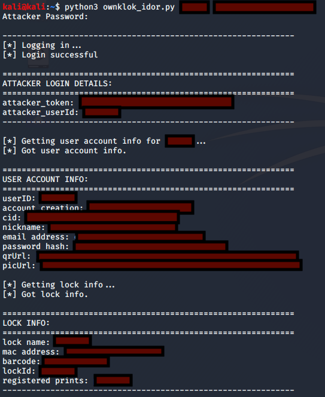

# CVE-2020-8791
>The OKLOK (3.1.1) mobile companion app for Fingerprint Bluetooth Padlock FB50 (2.3) allows remote attackers to submit API requests using authenticated but unauthorized tokens, resulting in IDOR issues. A remote attacker can use their own token to make unauthorized API requests on behalf of arbitrary user IDs. Valid and current user IDs are trivial to guess because of the user ID assignment convention used by the app. A remote attacker could harvest email addresses, unsalted MD5 password hashes, owner-assigned lock names, and owner-assigned fingerprint names for any range of arbitrary user IDs.

## ownklok_idor.py
> PoC code to obtain OKLOK (3.1.1) user account details such as email address, unsalted MD5 password hash, lock name, and fingerprint name.

## Usage
```python3 ownklok_idor.py <victim_userID> <attacker_email_address>```

`<victim_userID>` = the userID of the victim account <br/>
`<attacker_email_address>` = the email address of the attacker account, which will be used to generate an accepted token for the HTTP headers

**DISCLAIMER:** Use this script only against userIDs that you own or have permission to test. To check your userIDs, use the check_userID.py script in the 'extras' folder, or run the OKLOK mobile app through a proxy and observe the userID transmitted in the web requests.

## Demo
The demo below shows ownklok_idor.py in action. Details have been redacted.


