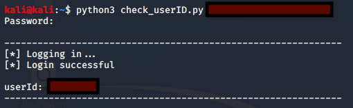

# Helper Code (Not PoC)

## check_userID.py
>Script that allows the user to login to an account and check the userID. This script can be used to find your userIDs, so they can be tested with ownklok_idor.py and attack_scenario_remote.py.

## Usage
```python3 check_userID.py <email_address>```

`<email_address>` = the email address of the user account for which you want to check the userID

## Demo
The script output should look like the example below. Details have been redacted.


